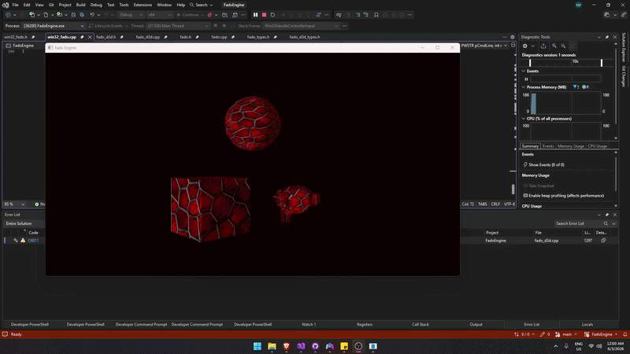

# Fado Game Engine

##### Ongoing project

Fado is a custom 3D game engine written in **C++** using **Direct3D 11**.
The engine is heavily data oriented; we have a bunch of structs, and create functions that operate on those structs.

### Latest Features
- Added functioning buttons.
- Implemented a UI commands bucket with custom UI system and ImGui for debugging.
- Game hot reloading.
- Image loading and compressing into custom file format with stb.
- AABB and OBB collision detection.
- Entities in an Entity Component System. Transforms, meshes and textures are set in arrays through handles. 
- Multiple shaders support (currenlty: simple unlit colors, lit/unlit textures).
- Memory Arena system that allocates memeory only at startup and uses it throughout the session.
- Fully resizable and full-screen toggle-supported window.
- Keyboard and multiple controllers input support with XInput.
- Custom .glb parser to load 3D models.

### Current Structure
##### Shared Code
- Includes the code that is used throughout all the files in the engine, mostly typedefs, #defines, structs and build options.
###### Files:
    fado_types.h

##### Game Layer
- Handles the game/engine input.
- This is still in the early stages, eventually, it'll be the gateway to all the interactive objects in the engine and/or game.
###### Files:
    fado.h
    fado.cpp

##### Rendering Layer
- Includes all of the DirectX11 rendering requirements and types.
- Currently consists of direct3D structs, initialization and rendering functions. Only init and Render are public and exposed to other files.
###### Files:
    fado_d3d_types.h
    fado_d3d.h
    fado_d3d.cpp

##### GLB Loader/Parser
- A simple JSON parser to load and parse .glb files. This feature allows users to import models from other programs like Blender or Maya into the engine.
- The loader doesn't allocate anything on the heap, it reuses the scratch Arena Memory instead.
###### Files:
    fado_glb.h
    fado_glb.cpp

##### Platform Layer
- This is where the program starts and the game loop begins (main).
- Currently, the engine is supported only for Windows with a Win32 platform layer.
- The main function uses VirtualAlloc once and allocates memeory that is used throughout the code, so that no dynamic allocations happen in the game (DX11 init is an expection as some elements are managed and freed by DX).
###### Files:
    win32_fado.h
    win32_fado.cpp
