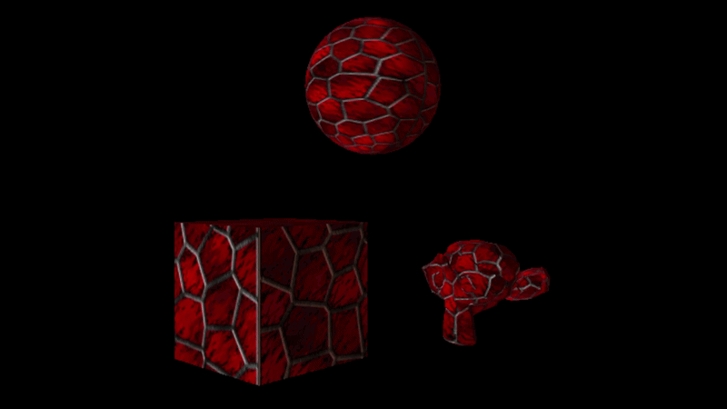

# Fado Game Engine

##### Ongoing project

Fado is a custom 3D game engine written in **C++** using **Direct3D 11**.  

##### Latest Features
- Custom .glb parser to load 3D models.
- Transforming models.
